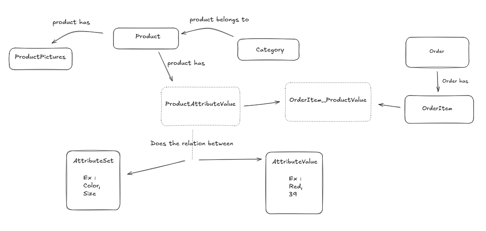

https://github.com/Ecodev/graphql-doctrine

# DB Schema


> The dotted entities are join tables

## GraphQL Requests

- Get All Products

```graphql
// Query
{
  products(filter: { category: "clothes" }) {
    id,
    name,
     inStock,
    category {
        name
    }
  }
}
```

- Get Product By ID

```graphql
// Query
{
  product(id: 5) {
    id,
    name,
    price,
    inStock,
    category {
      name
    },
    attributes { 
        name,
        values { 
            id,
            value
        }
    }
  }
}
```

- Create Order

```graphql
// Mutation
mutation {
  createOrder(input: {
    orderItems: [
      {
        productAttributeValueIds: [1,43],
        amount: 1
      },
      {
        productAttributeValueIds: [32,74],
        amount: 3
      }
    ]
  }) {
    id
    status
  }
}
```


